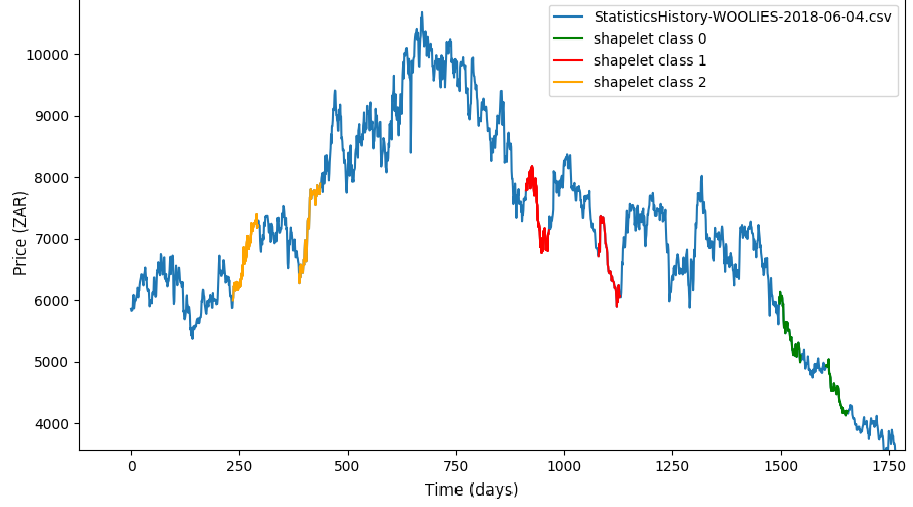

# Predicting financial time series by use of shapelets and trend lines while exploring the notion of concept drift within

## Aim
This was an honours thesis project. I worked on the part of the project that aimed at extracting recurring patterns/shapes from time series data for prediction. [Robby](https://github.com/robertbodley) worked on the trendline portion of the project. [Andre](https://github.com/AndreVent) explored the notion of concept drift and methods for detection and avoiding drift.

### Shapelets:
#### Intro
The inspiration for this project came from the work done by Lines et al. on the [Shapelets Transform](http://wan.poly.edu/KDD2012/docs/p289.pdf). Ye et al. introduced the [notion of shapelets](http://alumni.cs.ucr.edu/~lexiangy/Shapelet/kdd2009shapelet.pdf) in 2009 as a new data mining primitive.

#### Process
1. Extract variable length shapelets from the datasets of [35 stocks](./data/jse/). See below images for examples of the extracted shapelets classes and an illustration of the classes extracted.
2. Train a LSTM based classifier on the extracted shapelet classes.
3. Predict prices by inputting "future" sequences into the LSTM so that it can classify which pattern/shapelet the sequence looks like. Use the standardized version of that classified shape to predict prices by unstandardizing using the mean and standard deviation of the "future" sequence. See prediction images below.

#### Plot of shapelet classes

Extracted classes on the source dataset             |  Extracted classes (standardized shapes)
:-------------------------:|:-------------------------:
  |  

#### Predicting 1 day ahead

#### Predicting 7 days ahead

